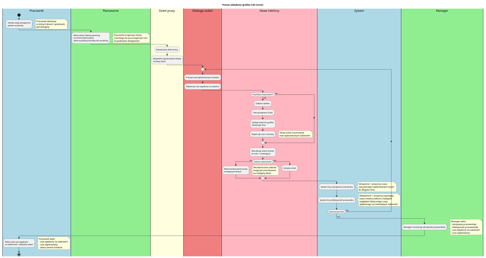

Aplikacja grafik call center
==

# Kontekst aplikacji

1. Mamy Call Center w jakiejś firmie telekomunikacyjnej, obsługujące różne “kolejki” tematyczne (np. sprzedaż, wsparcie techniczne, reklamacje itd)
2. Pracuje tam kilkadziesiąt osób w elastycznych godzinach pracy, dostępność ludzie deklarują z tygodniowym wyprzedzeniem, ale jest ona zmienna i może się zmienić po wygenerowaniu grafiku
3. Trudno jest układać grafik dla tych agentów, by pokryć zapotrzebowanie a jednocześnie, żeby nie było za dużo ich w ramach jednej godziny.
4. Różni agenci umieją obsługiwać różne kolejki (niektórzy wiele różnych kolejek, niektórzy 1-2 kolejki)
5. Każdy agent na danej kolejce ma swoją efektywność, bazującą na danych historycznych.
6. Znamy historię połączeń w minionych tygodniach na każdej kolejce, w każdej godzinie, celem robienia predykcji

# Proces układania grafika na następny tydzień

Zakładamy, że:
1. Pracownicy układają swoją dostępność z tygodniowym wyprzedzeniem
2. Zgłoszenia przychodzą na bieżąco i staramy się je jak najszybciej obsłużyć.
3. W rozmowie telefonicznej może być poruszony temat który jeszcze nie ma ticketa.
4. Pracownicy priorytetyzują odpowiadanie na bieżące telefony ponad to co mają na grafiku zaplanowane.
Tzn. jeśli pracownik nad czymś pracuje i zadzwoni telefon i nie ma innego wolnego pracownika który by mógł odebrać telefon, to czasem przerwie bieżącą pracę i odbierze telefon.

## Diagram procesu układania grafika

# Moduły aplikacji na backendzie
Backend w Symfony, PHP. DB w MySQL. Server-sent events poprzez Mercure, Mercure Hub.
Do dat użyjemy Carbon.
Zakładamy możliwość stworzenia rozproszonego systemu w przyszłości.

## Moduł BackendForFrontend
Zawiera wszystkie endpointy, reszta modułów zawiera tylko fasady

## Moduł kategorii ticketów
Moduł serwisowy (fasada) zarządzający kategoriami ticketów (kolejkami tematycznymi) w systemie Call Center.
Zawiera różne kategorie (np. sprzedaż, wsparcie techniczne, reklamacje itd). Na razie będą zhardkodowane.
Zawiera domyślny czas rozwiązania ticketa per kategoria w minutach. Te też na razie będą zhardkodowane.
Moduł nie zawiera endpointów API - endpointy HTTP są zaimplementowane w module BackendForFrontend.

[Szczegółowa dokumentacja modułu](backend/src/Modules/TicketCategories/readme.md)

## Moduł klientów
Moduł serwisowy (fasada) zarządzający danymi klientów zgłaszających tickety do systemu.
Klienci to są te osoby, które zgłaszają tickety do systemu.
Klienci nie koniecznie muszą być autoryzowani (mogą być anonimowi ze strony internetowej, jeszcze nie zidentyfikowani z rozmowy telefonicznej).
Moduł nie zawiera endpointów API - endpointy HTTP są zaimplementowane w module BackendForFrontend.

[Szczegółowa dokumentacja modułu](backend/src/Modules/Clients/readme.md)

## Moduł ticketów
Moduł serwisowy (fasada) zarządzający ticketami i ich historią w systemie Call Center.
Zawiera tickety i ich historię. Historia zawiera faktyczny czas spędzony na danym tickecie w przeszłości przez pracowników (czas rozmowy telefonicznej).
Ticket jest przypisany do kategorii i klienta.
Zawiera status ticketa czyli czy jest zamknięty, czy oczekuje na odpowiedź z naszej strony, czy oczekuje na odpowiedź ze strony klienta.
Może policzyć efektywność pracownika na podstawie historii ticketów w danej kategorii.
Ticket może zawierać czas rozpoczęcia jego obsługi bez czasu zakończenia (czyli ticket jest w toku).
Moduł nie zawiera endpointów API - endpointy HTTP są zaimplementowane w module BackendForFrontend.

[Szczegółowa dokumentacja modułu](backend/src/Modules/Tickets/readme.md)

## Moduł autoryzacji pracowników
Moduł serwisowy (fasada) zarządzający uprawnieniami dostępu pracowników do kategorii ticketów oraz określający ich role w systemie.
Pracownik przegląda i odpisuje na tickety tych kategorii do których jest przypisany.
Ten moduł autoryzuje pracownika do dostępu do kategorii.
Zawiera zarządzanie rolą managera (czy pracownik jest managerem).
Moduł nie zawiera endpointów API - endpointy HTTP są zaimplementowane w module BackendForFrontend.

[Szczegółowa dokumentacja modułu](backend/src/Modules/Authorization/readme.md)

## Moduł dostępności pracownika
Moduł serwisowy (fasada) zarządzający dostępnością pracowników w systemie Call Center.
Zawiera dostępność pracownika - w których dniach i godzinach jest dostępny.
Pracownicy deklarują dostępność z tygodniowym wyprzedzeniem, ale jest ona zmienna i może się zmienić po wygenerowaniu grafiku.
Pracownik może mieć wiele dostępności w jednym dniu (np. 9:00-12:00 i 14:00-17:00).
Moduł nie zawiera endpointów API - endpointy HTTP są zaimplementowane w module BackendForFrontend.

[Szczegółowa dokumentacja modułu](backend/src/Modules/WorkerAvailability/readme.md)

## Moduł grafika pracownika
Moduł serwisowy (fasada) zarządzający planowanym przypisaniem ticketów do pracowników w określonych dniach.
Zawiera zaplanowane przypisanie pracownika do ticketa w danym dniu.
Zawiera możliwość automatycznego przypisania ticketów do pracowników na podstawie ich efektywności, dostępności i domyślnego czasu rozwiązania z kategorii.
Moduł nie zawiera endpointów API - endpointy HTTP są zaimplementowane w module BackendForFrontend.

[Szczegółowa dokumentacja modułu](backend/src/Modules/WorkerSchedule/readme.md)

## Moduł autentykacji pracowników
Moduł serwisowy (fasada) odpowiadający za podstawową identyfikację i weryfikację tożsamości pracowników w systemie.
Zajmuje się rejestrowaniem nowych pracowników (tworzenie kont pracowniczych z loginem i hasłem) - dostępne tylko dla managera - oraz weryfikacją tożsamości (sprawdzanie poprawności loginu i hasła).
Zarządza hasłami (przechowywanie zahashowanych haseł zgodnie z najlepszymi praktykami bezpieczeństwa) oraz encjami pracowników.
Moduł ten jest odpowiedzialny wyłącznie za autentykację (kto jest zalogowany), natomiast autoryzacja (do jakich kategorii ma dostęp) jest obsługiwana przez osobny moduł Authorization.
Moduł nie zawiera endpointów API - endpointy HTTP są zaimplementowane w module BackendForFrontend.

[Szczegółowa dokumentacja modułu](backend/src/Modules/Authentication/readme.md)

# Moduły aplikacji na front-endzie
Frontend w react.js.

## Moduły bez autentykacji

### Moduł dodawania ticketów przez klientów
Moduł umożliwia klientom (w tym anonimowym) utworzenie nowego ticketa w systemie Call Center. Zbiera dane potrzebne do zainicjalizowania ticketa: dane kontaktowe klienta (email, telefon, imię, nazwisko - wszystkie pola opcjonalne), wybór kategorii ticketa (wymagane), tytuł i opis problemu (opcjonalne). Po pomyślnym utworzeniu ticketa, moduł automatycznie uruchamia moduł `ticket-chat`, który przejmuje dalszą komunikację z klientem. Moduł działa bez autentykacji - klienci mogą tworzyć tickety bez konieczności logowania się do systemu.

[Szczegółowa dokumentacja modułu](frontend/app/modules/unauthenticated/ticket-add/readme.md)

### Moduł odpowiadania na tickety przez klientów
Moduł chatu ticketa uruchamiany automatycznie po utworzeniu nowego ticketa przez klienta (z modułu `ticket-add`). Umożliwia kontynuację rozmowy w ramach ticketa. Wyświetla historię wiadomości (zarówno od klienta, jak i od pracowników), umożliwia wysyłanie dalszych wiadomości oraz odbiera na bieżąco nowe wiadomości od pracowników poprzez Server-Sent Events (SSE) wysyłane przez Mercure. Wyświetla aktualny status ticketa (np. oczekujący, w toku, zamknięty) oraz obsługuje przerwania połączenia SSE z automatycznym ponownym połączeniem. Moduł działa bez autentykacji - klienci mogą komunikować się z pracownikami bez konieczności logowania się do systemu.

[Szczegółowa dokumentacja modułu](frontend/app/modules/unauthenticated/ticket-chat/readme.md)

### Moduł logowania się do aplikacji przez pracowników
Moduł umożliwia pracownikom zalogowanie się do systemu Call Center. Zawiera formularz logowania z polami na login i hasło oraz przycisk do wysłania żądania autentykacji. Weryfikuje poprawność wprowadzonych danych przed wysłaniem. Po pomyślnym zalogowaniu, backend ustawia sesję (cookie, token JWT lub inny mechanizm), a moduł przekierowuje pracownika do strony `/worker`. Obsługuje wyświetlanie komunikatów błędów w przypadku nieprawidłowych danych logowania lub problemów z połączeniem. Moduł działa bez autentykacji - jest to strona logowania, która umożliwia pracownikom uzyskanie dostępu do systemu.

[Szczegółowa dokumentacja modułu](frontend/app/modules/unauthenticated/worker-login/readme.md)

## Moduły pracowników po autentykacji
Layout opasujący strony opisany [tutaj](frontend/app/pages/worker/layout/readme.md)

### Moduł grafika pracownika
Główne centrum pracy dla pracownika, pierwsza strona którą zobaczy po zalogowaniu. Wyświetla aktualny dzień oraz następny dzień, w którym pracownik jest dostępny, wraz z zaplanowanymi ticketami. Umożliwia pracownikowi wybór jednego ticketa, nad którym aktualnie pracuje, spośród tych, które zostały mu zaplanowane. Pokazuje przypisane tickety i czas na nich spędzony dzisiaj. Umożliwia dodanie czasu spędzonego na rozmowie telefonicznej. Umożliwia zmianę statusu ticketa na 'w toku' lub 'oczekujący'. Jeśli ticket ma status 'w toku', to jego czas jest automatycznie rejestrowany. Posiada duży przycisk 'odbieram telefon', który uruchamia moduł 'odbieram telefon'. Posiada status bar z ostrzeżeniami, jeśli pracownik ma za mało lub za dużo pracy. Posiada na górze strony sekcję z ticketem 'w toku' i możliwością dodawania notatek do tego ticketa. Odbiera na bieżąco zmiany w planingu poprzez Server-Sent Events (SSE), zapewniając synchronizację danych w czasie rzeczywistym.

[Szczegółowa dokumentacja modułu](frontend/app/modules/worker/worker-schedule/readme.md)

### Moduł 'odbieram telefon'
Moduł reprezentuje odebranie telefonu, jeszcze nie wiemy w jakiej sprawie i od kogo on jest. Składa się z przycisku 'Odbieram telefon', który uruchamia okienko (modal/dialog) z całą obsługą odbioru telefonu. W momencie odebrania telefonu aplikacja zacznie rejestrować czas połączenia. Przerwie rejestrowanie czasu innych ticketów i przestawi je na status 'oczekujący'. W module jest możliwość wyszukania istniejącego ticketa, a także stworzenia nowego ticketa. Po wybraniu istniejącego ticketa lub stworzeniu nowego, umożliwia dodanie notatek do tego ticketa podczas rozmowy. Wyświetla licznik czasu trwania połączenia w czasie rzeczywistym. Po zakończeniu połączenia pracownik klika 'Zakończyłem połączenie', a aplikacja zarejestruje czas połączenia do wybranego ticketa. Po zakończeniu połączenia, nowostworzony/wybrany ticket jest automatycznie dodawany do grafika bieżącego dnia, a jego status jest oznaczany na 'w toku' (a jego czas rejestrowany). W tym momencie pracownik ma czas żeby wykonać operacje związane z rozmową którą właśnie przeprowadził. Jeśli żaden nowy ticket nie został wybrany podczas rozmowy, ticket sprzed rozmowy jest ustawiany jako 'w toku'.

[Szczegółowa dokumentacja modułu](frontend/app/modules/worker/worker-phone-receive/readme.md)

### Moduł przypisania/planowania ticketów
Moduł umożliwia pracownikowi planowanie i przypisywanie ticketów z backlogu na najbliższy tydzień. Wyświetla backlog ticketów spośród kategorii, do których pracownik ma dostęp, oraz najbliższe 7 dni z dostępnością pracownika. Pokazuje przewidywaną ilość ticketów, którą pracownik może obsłużyć danego dnia, bazując na jego dostępności, efektywności oraz domyślnym czasie rozwiązania z kategorii. Umożliwia ręczne przypisanie ticketów na poszczególne dostępne dni (przez drag & drop lub wybór). Umożliwia filtrowanie i sortowanie ticketów według kategorii, statusu, priorytetu. Umożliwia automatyczne dopisanie ticketów do wszystkich dni na podstawie przewidywanej ilości obsługiwanych ticketów. Umożliwia edycję przypisań (usunięcie przypisania ticketa lub przeniesienie go na inny dzień).

[Szczegółowa dokumentacja modułu](frontend/app/modules/worker/ticket-planning/readme.md)

### Moduł ustawiania dostępności
Moduł umożliwia pracownikowi deklarowanie swojej dostępności w systemie Call Center. Wyświetla najbliższe 7 dni i pozwala pracownikowi ustawić godziny, w których jest dostępny w poszczególnych dniach. Pracownik może mieć wiele dostępności w jednym dniu (np. 9:00-12:00 i 14:00-17:00). Wszystkie zmiany są zapisywane na serwerze w czasie rzeczywistym. Moduł waliduje przedziały czasowe (sprawdzanie poprawności ustawionych godzin, np. nie nakładające się przedziały, poprawna kolejność godzin). Umożliwia kopiowanie dostępności z jednego dnia na inne dni oraz szybkie szablony (możliwość szybkiego ustawienia typowych godzin pracy, np. 9:00-17:00). Pracownicy deklarują dostępność z tygodniowym wyprzedzeniem, ale jest ona zmienna i może się zmienić po wygenerowaniu grafiku.

[Szczegółowa dokumentacja modułu](frontend/app/modules/worker/worker-availability/readme.md)

### Moduł dodawania pracowników (tylko dla managera)
Moduł umożliwia managerowi zarejestrowanie nowego pracownika w systemie Call Center. Moduł zawiera wyłącznie formularz rejestracji pracownika. Formularz zawiera: pole loginu pracownika (wymagane), pole hasła pracownika (wymagane), pole potwierdzenia hasła (wymagane), listę checkboxów z kategoriami ticketów do przypisania uprawnień, checkbox do oznaczenia pracownika jako managera (opcjonalnie). Moduł weryfikuje poprawność wprowadzonych danych przed wysłaniem (walidacja loginu, hasła, potwierdzenia hasła, wyboru kategorii). Obsługuje wyświetlanie komunikatów błędów w przypadku nieprawidłowych danych lub problemów z połączeniem. Po pomyślnej rejestracji wyświetla komunikat sukcesu i umożliwia rejestrację kolejnego pracownika. Moduł jest dostępny wyłącznie dla zalogowanych pracowników z rolą managera.

[Szczegółowa dokumentacja modułu](frontend/app/modules/manager/worker-register/readme.md)

### Moduł monitoringu dla kierownika
Moduł umożliwia kierownikowi monitorowanie stanu systemu Call Center w czasie rzeczywistym. Wyświetla w danym dniu ogólne statystyki obciążenia pracowników (liczba ticketów, czas spędzony, czas zaplanowany, efektywność, poziom obciążenia). Pokazuje ilość oczekujących ticketów w poszczególnych kolejkach (kategoriach) wraz ze statystykami dla każdej kolejki (liczba oczekujących, w toku, zamkniętych, średni czas rozwiązania, liczba przypisanych pracowników). Umożliwia wybór dnia monitoringu (domyślnie dzisiejszy dzień). Wyświetla szczegółowe statystyki pracowników oraz wizualizację danych (wykresy i wskaźniki wizualne przedstawiające stan systemu). Odbiera zmiany w systemie poprzez Server-Sent Events (SSE), zapewniając aktualizację w czasie rzeczywistym. Umożliwia włączenie/wyłączenie automatycznego przypisywania zadań dla pracowników i kolejek oraz ręczne uruchomienie automatycznego przypisywania. Moduł jest dostępny wyłącznie dla zalogowanych pracowników z rolą managera.

[Szczegółowa dokumentacja modułu](frontend/app/modules/manager/manager-monitoring/readme.md)